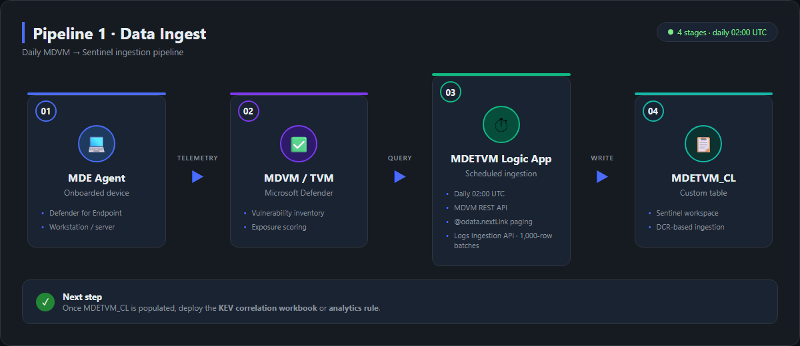
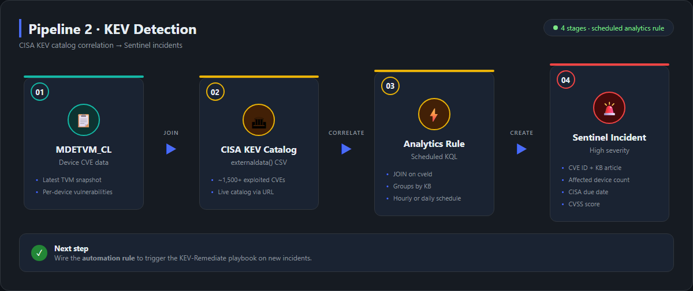
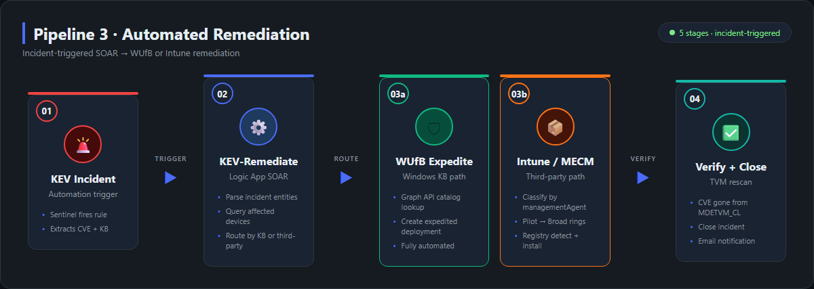

# 🛡️ Sentinel KEV Remediation Framework

Modular solution for detecting and remediating [CISA Known Exploited Vulnerabilities (KEVs)](https://www.cisa.gov/known-exploited-vulnerabilities-catalog) using Microsoft Defender Vulnerability Management (MDVM), Microsoft Sentinel, and Intune/WUfB.

**Each component is independent.** Deploy only what you need:

| Component | What It Does | Requires |
|---|---|---|
| **TVM Data Ingest** | Daily pipeline: MDE API → `MDETVM_CL` custom table in Sentinel | Sentinel, MDE P2 |
| **Sentinel Analytics** | KQL rule correlates `MDETVM_CL` against the CISA KEV catalog → incidents | TVM Data Ingest |
| **Sentinel Workbooks** | Visual dashboards for KEV exposure and remediation tracking | TVM Data Ingest |
| **KEV Remediation** | SOAR playbook: auto-remediate via WUfB (Windows KBs) or Intune (third-party) | Sentinel Analytics + Intune |

---

## 🏗️ Architecture

### Pipeline 1 · Data Ingest



---

### Pipeline 2 · KEV Detection



---

### Pipeline 3 · Automated Remediation



---

## 📁 Repo Layout

```text
Sentinel-KEV-Remediation-Framework/
├── README.md
├── LICENSE
│
├── tvm-data-ingest/                 ← Daily data pipeline (independent)
│   ├── MDETVM-LogicApp.json
│   ├── MDETVM-LogicApp.gov.json
│   ├── Assign-MDVMPermissions.ps1
│   ├── Verify-MDVMTables.kql
│   └── Pipeline-Health-Alerts.json
│
├── sentinel-analytics/              ← KEV detection rules (requires tvm-data-ingest)
│   ├── CISA-KEV-MDVM-Correlation.kql
│   ├── CISA-KEV-MDVM-AnalyticsRule.json
│   ├── KEV-Exceptions-Watchlist.json
│   ├── Detect-LogicAppDefinitionChange.json     ← Hardening detection
│   ├── Detect-MIClosedIncident.json             ← Hardening detection
│   ├── Detect-WatchlistChange.json              ← Hardening detection
│   └── Detect-KEVRemediateFailure.json          ← Hardening detection
│
├── sentinel-workbooks/              ← Dashboards (requires tvm-data-ingest)
│   ├── MDETVM-KEV-Workbook.json
│   └── KEV-Workbook-GalleryTemplate.json
│
└── kev-remediation/                 ← Automated remediation (requires sentinel-analytics)
    ├── KEV-Remediate-LogicApp.json
    ├── KEV-Remediate-AutomationRule.json
    ├── Assign-KEVRemediatePermissions.ps1
    ├── Patch-ThirdPartyApprovalPath.ps1
    ├── Update-KEVRemediateThirdPartyPath.ps1
    ├── Verify-Remediation.ps1
    ├── Setup-IntuneBaseline.ps1
    ├── Intune-KEV-Starter-Policy.md
    ├── AutoClose-KEVIncidents-LogicApp.json
    └── AutoClose-KEVIncidents-LogicApp.gov.json

└── security/                        ← Tenant-level hardening (run once per tenant)
    ├── README.md
    ├── Lock-MailSendScope-RBAC.ps1   ← Recommended (Exchange Admin; modern RBAC for Apps)
    ├── Lock-MailSendScope.ps1        ← Legacy fallback (Application Access Policy)
    └── Move-TeamsWebhookToKeyVault.ps1 ← Optional (RG Owner; only if using Teams)
```

---

## 🚀 Quick Start

### Option 1 — Workbook Only (Visibility)

```powershell
# Deploy the data pipeline
az deployment group create -g <rg> `
  --template-file tvm-data-ingest/commercial/MDETVM-LogicApp.json `
  --parameters PlaybookName=MDETVM WorkspaceName=<ws>

# Grant permissions
./tvm-data-ingest/commercial/Assign-MDVMPermissions.ps1 `
  -TenantId <tenant> -ResourceGroupName <rg> -WorkspaceName <ws> -PlaybookName MDETVM

# Deploy workbook
az deployment group create -g <rg> `
  --template-file sentinel-workbooks/MDETVM-KEV-Workbook.json `
  --parameters workspaceId=<workspace-resource-id>
```

### Option 2 — Detection + Incidents (Alerting)

```powershell
# After Option 1, add the analytics rules
az deployment group create -g <rg> `
  --template-file sentinel-analytics/CISA-KEV-MDVM-AnalyticsRule.json `
  --parameters workspace=<ws>

# Optional: deploy the four hardening detection rules (ship disabled; review then enable)
foreach ($rule in 'Detect-LogicAppDefinitionChange','Detect-MIClosedIncident','Detect-WatchlistChange','Detect-KEVRemediateFailure') {
  az deployment group create -g <rg> `
    --template-file "sentinel-analytics/$rule.json" `
    --parameters workspace=<ws>
}
```

### Option 3 — Full Automation (Remediation)

```powershell
# After Option 2, deploy the remediation playbook
az deployment group create -g <rg> `
  --template-file kev-remediation/commercial/KEV-Remediate-LogicApp.json `
  --parameters WorkspaceName=<ws> GraphApiBase=https://graph.microsoft.com

# Grant permissions (includes Intune + WUfB roles)
./kev-remediation/commercial/Assign-KEVRemediatePermissions.ps1 `
  -ResourceGroupName <rg> -WorkspaceName <ws>

# Wire incidents to the playbook
az deployment group create -g <rg> `
  --template-file kev-remediation/shared/KEV-Remediate-AutomationRule.json `
  --parameters WorkspaceName=<ws> PlaybookResourceId=<logic-app-resource-id>
```

### Trigger the First Data Pull

The MDETVM Logic App runs daily at **02:00 UTC**. To pull data immediately after deployment:

```powershell
# Manual run via CLI
az logic workflow trigger run `
  -g <rg> --name MDETVM --trigger-name Recurrence
```

Or in the Portal: open the **MDETVM** Logic App → **Run Trigger** → **Recurrence**.

First run typically takes 5–20 minutes depending on environment size. Watch the run history for failures (HTTP 403 = permissions issue, re-run `Assign-MDVMPermissions.ps1`).

### Verify Data Landed in `MDETVM_CL`

Wait 10–15 minutes after the first successful run, then run this in **Sentinel → Logs**:

```kql
MDETVM_CL
| summarize
    TotalRecords = count(),
    Devices      = dcount(deviceName),
    UniqueCVEs   = dcount(cveId),
    MostRecent   = max(TimeGenerated)
```

Expect `Devices > 0` and `UniqueCVEs > 0`. If the table doesn't exist, the Logic App hasn't completed a successful run yet.

> **Intune baseline:** If the tenant doesn't have Intune update rings or MDM enrollment configured, see [Intune-KEV-Starter-Policy.md](kev-remediation/shared/Intune-KEV-Starter-Policy.md).

---

## 📊 About `MDETVM_CL`

`MDETVM_CL` is a single custom Sentinel table that flattens data from two native Defender tables:

| Native Table | What It Provides |
|---|---|
| `DeviceTvmSoftwareVulnerabilities` | CVEs per device, software info, recommended KB |
| `DeviceTvmSoftwareVulnerabilitiesKB` | CVSS score, exploit availability, severity level |

The MDE REST API returns this data pre-joined — no joins needed in Sentinel KQL.

---

## 🔧 How Patching Actually Works

This framework only **automates a slice** of patching. Most updates are still delivered by Intune / Windows Update for Business (WUfB) on their normal cadence. This section spells out exactly what the project does, what it doesn't do, and what your tenant must already have in place for the rest.

### What This Framework Does

| Update Type | What This Framework Does | Underlying Mechanism |
|---|---|---|
| **Windows quality updates (KBs)** | Expedites the KB to affected devices when a KEV is detected | Graph `windowsUpdates/deploymentAudiences` → `expedite` ([docs](https://learn.microsoft.com/graph/windowsupdates-deploy-expedited-update)) |
| **Third-party apps (Intune-managed) — production / gov path** | Logic App calls Graph `POST /deviceAppManagement/mobileApps/{id}/assignments` to assign a pre-packaged Intune Win32 app (or Enterprise App Catalog app) to affected devices | Graph `deviceAppManagement/mobileApps` ([docs](https://learn.microsoft.com/intune/app-management/deployment/add-win32)). See [`kev-remediation/shared/Package-Win32App-Guide.md`](kev-remediation/shared/Package-Win32App-Guide.md) and [`kev-remediation/shared/Win32-App-Mapping.json`](kev-remediation/shared/Win32-App-Mapping.json). |
| **Third-party apps (Intune-managed) — lab/POC** ⚠️ *Archived* | Triggered an on-demand proactive remediation script that downloaded vendor installers from the public internet and ran them silently. Replaced by the production path above. Source kept under [`_archive-remediation-poc/`](_archive-remediation-poc/) for reference. | Graph `deviceManagement/managedDevices/{id}/initiateOnDemandProactiveRemediation` |
| **Third-party apps (MECM-managed)** | Sends an email + Teams notification with the CVE, devices, and required version. No automated push | Manual hand-off |

> ⚠️ **Production third-party patching is fully supported via Intune Win32 app assignments.** The original lab-only Proactive Remediation script (which pulled installers from public internet sites) has been **archived** to [`_archive-remediation-poc/`](_archive-remediation-poc/). For production and government tenants, follow [`kev-remediation/shared/Package-Win32App-Guide.md`](kev-remediation/shared/Package-Win32App-Guide.md) — Intune admin packages each app once (`.intunewin` or Enterprise App Catalog), Logic App pushes the assignment via Graph, no public internet egress at runtime. See *Known Gaps* below for related items still on the roadmap.

### What This Framework Does Not Do

| Update Type | Why Not | Where It Actually Gets Handled |
|---|---|---|
| **Windows feature updates** (e.g., 23H2 → 24H2) | No expedite API exists for feature updates ([Autopatch capabilities table](https://learn.microsoft.com/graph/windowsupdates-concept-overview#capabilities-of-windows-autopatch)) | Intune **Feature update policy** ([docs](https://learn.microsoft.com/intune/device-updates/windows/)) |
| **Driver / firmware updates** | No expedite API exists for drivers (same capabilities table) | Intune **Windows driver update policy** ([docs](https://learn.microsoft.com/intune/device-updates/windows/manage-driver-updates)) |
| **Microsoft 365 Apps (Office)** | Office uses Click-to-Run channels, not Windows Update | M365 Apps **update channels** + Office Deployment Tool / Cloud Update / Config Mgr ([docs](https://learn.microsoft.com/microsoft-365-apps/updates/overview-update-channels)) |
| **Microsoft Edge** | Edge has its own updater (auto-updates by default) | Allow Edge to self-update **OR** manage via Autopatch / Edge Update policies ([docs](https://learn.microsoft.com/deployedge/microsoft-edge-update-policies)) |
| **.NET Framework / Visual C++ runtimes** | These ride on Windows monthly cumulative updates | Already covered by your **Quality update ring** |
| **Win32 LOB / non-Intune-managed apps** | No standard install method to call | Package as a Win32 app with **supersedence** ([docs](https://learn.microsoft.com/intune/app-management/deployment/add-win32)) |

### Why KEVs Persist After Intune Rings Run

- **Detection runs daily.** A device must check in, install the KB, and report back to MDE before MDVM stops flagging it. There's normally a 24–72 hour window where a KEV looks "open" even though the patch is on the way.
- **Patches may exist in the catalog before your ring deploys them.** Quality update rings ship in waves (pilot → broad). Devices in a later wave still show the CVE until their wave runs.
- **Ring deferral may exceed CISA due date.** CISA gives ~21 days for KEVs. If your broad ring is deferred 14 days plus a 7-day deadline, you'll miss the window for some devices unless you expedite — which is exactly what this framework does.

### Required Configuration per Update Type

Before the framework can do its job, your tenant should already be set up for the categories below. None of this is created by the framework.

| Update Type | Required Configuration | Where It Lives |
|---|---|---|
| **Windows quality updates** | Update ring with `Allow Microsoft product updates = Allow` so .NET / Defender platform updates flow with the OS | Intune → Devices → Windows → Update rings |
| **Windows feature updates** | Feature update policy pinned to the target version | Intune → Devices → Windows → Feature updates |
| **Drivers / firmware** | Driver update policy (auto-approve recommended drivers, deferral 0–30 days) ([docs](https://learn.microsoft.com/intune/device-updates/windows/configure-driver-update-policy)) | Intune → Devices → Windows → Driver updates |
| **Microsoft 365 Apps** | Update channel (Current / Monthly Enterprise / Semi-Annual) configured via ODT, Cloud Update, or Config Mgr ([docs](https://learn.microsoft.com/microsoft-365-apps/updates/configure-update-settings-microsoft-365-apps)) | Office Deployment Tool / M365 admin center / ConfigMgr |
| **Microsoft Edge** | Either leave Edge auto-update on (default) **or** turn on Autopatch Edge updates per Autopatch group ([docs](https://learn.microsoft.com/windows/deployment/windows-autopatch/manage/windows-autopatch-edge)) | Edge Update policies / Intune → Tenant Admin → Windows Autopatch |
| **Third-party apps (Intune)** | Devices Intune-MDM-enrolled + Intune Management Extension installed; vendor installers reachable from device | Intune → Devices |
| **Third-party apps (MECM)** | Standard ConfigMgr application + supersedence rules | Configuration Manager |

### Known Gaps

| Gap | Impact | How to Fix It |
|---|---|---|
| **No automated remediation for non-Intune devices** | MECM-only and unmanaged devices fall back to email + Teams notification — humans take action | Co-management or Intune MDM enrollment. For pure MECM shops: build an Automatic Deployment Rule that subscribes to the email notifications and pushes the patch via standard ConfigMgr application deployment. |
| **Lab-only third-party install path** ✅ *Resolved* | The legacy `Update-KEVRemediateThirdPartyPath.ps1` script made each device pull installers from sites like `github.com` and `7-zip.org` at runtime — fine for a lab tenant, not appropriate for prod or gov | **Resolved by the Win32 app assignment path.** See [`kev-remediation/commercial/KEV-Remediate-Win32-Snippet.json`](kev-remediation/commercial/KEV-Remediate-Win32-Snippet.json) and [`kev-remediation/gov/KEV-Remediate-Win32-Snippet.gov.json`](kev-remediation/gov/KEV-Remediate-Win32-Snippet.gov.json) (drop-in Logic App scopes), [`kev-remediation/shared/Win32-App-Mapping.json`](kev-remediation/shared/Win32-App-Mapping.json) (CVE→app GUID lookup), [`kev-remediation/shared/Package-Win32App-Guide.md`](kev-remediation/shared/Package-Win32App-Guide.md) (admin packaging runbook), and [`kev-remediation/gov/Assign-KEVRemediatePermissions.gov.ps1`](kev-remediation/gov/Assign-KEVRemediatePermissions.gov.ps1) (gov perms with `DeviceManagementApps.ReadWrite.All`). Legacy script archived to [`_archive-remediation-poc/`](_archive-remediation-poc/). |
| **Tenant-wide impersonation risk on `Mail.Send`** | Without scoping, the Logic App's managed identity can send mail as **any user** in the tenant | Run [`security/Lock-MailSendScope-RBAC.ps1`](security/Lock-MailSendScope-RBAC.ps1) (modern RBAC for Apps) to scope the MI to a single approved mailbox. Legacy `Lock-MailSendScope.ps1` still works as a fallback. |
| **No automated rollback for failed deployments** | A bad KB or installer requires the help desk to manually clean up | **Use a pilot ring** in Intune (small canary group) before broad deployment. Let the Logic App expedite to the pilot first; broad ring follows on its normal cadence. If the pilot fires alerts, pause the analytics rule before the broad ring picks it up. For driver issues, use Intune's **Pause** action on the driver update policy ([docs](https://learn.microsoft.com/intune/device-updates/windows/configure-driver-update-policy)). |
| **Microsoft 365 Apps, Edge, drivers, and feature updates not auto-triggered** | Those CVEs stay open until their normal Intune policy runs | Configure the policies in the *Required Configuration per Update Type* table above. Specifically: turn on `Allow Microsoft product updates` in update rings, configure M365 Apps update channel via ODT or Cloud Update, leave Edge auto-update on (or use Autopatch), and create a Windows driver update policy. |

### Microsoft Learn References

- [Deploy expedited quality updates via Graph](https://learn.microsoft.com/graph/windowsupdates-deploy-expedited-update)
- [Capabilities of Windows Autopatch (expedite supports quality only)](https://learn.microsoft.com/graph/windowsupdates-concept-overview#capabilities-of-windows-autopatch)
- [Windows update management overview (Intune)](https://learn.microsoft.com/intune/device-updates/windows/)
- [Manage Windows driver updates](https://learn.microsoft.com/intune/device-updates/windows/manage-driver-updates)
- [Configure update settings for Microsoft 365 Apps](https://learn.microsoft.com/microsoft-365-apps/updates/configure-update-settings-microsoft-365-apps)
- [Microsoft 365 Apps update channels](https://learn.microsoft.com/microsoft-365-apps/updates/overview-update-channels)
- [Microsoft Edge update policies](https://learn.microsoft.com/deployedge/microsoft-edge-update-policies)
- [Windows Autopatch — Microsoft Edge updates](https://learn.microsoft.com/windows/deployment/windows-autopatch/manage/windows-autopatch-edge)
- [Add a Win32 app to Intune (with supersedence)](https://learn.microsoft.com/intune/app-management/deployment/add-win32)

---

## ⚙️ Prerequisites

| Requirement | Component |
|---|---|
| Azure subscription (Commercial, GCC, or GCC High) | All |
| Sentinel workspace | TVM Data Ingest, Sentinel Analytics, Sentinel Workbooks, KEV Remediation |
| Defender for Endpoint P2 with MDVM | All |
| Windows E3/E5 | KEV Remediation (WUfB path) |
| Intune Plan 1 + Entra ID P1/P2 | KEV Remediation (third-party path) |
| Az CLI | Deployment |

---

## 🔐 Permissions

| Component | Identity | Permission | Scope |
|---|---|---|---|
| TVM Data Ingest | Logic App MI | `Vulnerability.Read.All` | WindowsDefenderATP |
| TVM Data Ingest | Logic App MI | `Monitoring Metrics Publisher` | DCR resource |
| Sentinel Workbooks | User/group | `Microsoft Sentinel Reader` | Workspace RG |
| KEV Remediation | Logic App MI | `Microsoft Sentinel Responder` | Workspace |
| KEV Remediation | Logic App MI | `Log Analytics Reader` | Workspace |
| KEV Remediation | Logic App MI | `WindowsUpdates.ReadWrite.All` | Graph API |
| KEV Remediation | Logic App MI | `Device.Read.All` | Graph API |
| KEV Remediation | Logic App MI | `DeviceManagementManagedDevices.Read.All` | Graph API |
| KEV Remediation | Logic App MI | `DeviceManagementManagedDevices.PrivilegedOperations.All` | Graph API |
| KEV Remediation | Logic App MI | `DeviceManagementScripts.ReadWrite.All` | Graph API |
| KEV Remediation | Logic App MI | `Mail.Send` | Graph API |
| KEV Remediation | Logic App MI | `Windows Update Deployment Administrator` | Entra role |

> ⚠️ **Security note on `Mail.Send`:** This application permission lets the managed identity send email as **any user** in the tenant. **Required for prod:** scope it down with [`security/Lock-MailSendScope-RBAC.ps1`](security/Lock-MailSendScope-RBAC.ps1) (modern RBAC for Applications) or the legacy [`security/Lock-MailSendScope.ps1`](security/Lock-MailSendScope.ps1) fallback.

---

## 🩺 Troubleshooting

| Symptom | Cause | Fix |
|---|---|---|
| `RequestEntityTooLarge` in Logic App | Batch >1 MB | Lower the `BatchSize` variable |
| `MDETVM_CL` empty after 204 | Schema lag | Wait 15–30 min; check DCR diagnostics |
| `403 Missing application roles` | MI token cache | Recycle MI identity, re-grant roles |
| Intune remediation stays `pending` | IME not installed | Assign IME bootstrap script to device group |
| `initiateOnDemandProactiveRemediation` 404 | Device not MDM-managed | Enroll device into Intune MDM |
| Detection finds no updates | Packages already current | Check registry versions on device |
| No `MdmUrl` after enrollment | User not in MDM scope | Add user to auto-enrollment group |
| WUfB expedited deployment has no effect | Device not Entra joined | Device must be Entra joined or hybrid joined |

---

## ☁️ Cloud Support

| Cloud | Graph API Base | MDE API Base | Notes |
|---|---|---|---|
| Commercial | `https://graph.microsoft.com` | `https://api.securitycenter.microsoft.com` | Default |
| GCC | `https://graph.microsoft.com` | `https://api-gcc.securitycenter.microsoft.us` | Same Graph base as Commercial |
| GCC High | `https://graph.microsoft.us` | `https://api-gov.securitycenter.microsoft.us` | Different Graph base |

---

## 🔒 Security Hardening

Most hardening is **baked into the base templates** — anyone running the Quick Start gets it for free, no extra steps.

### Auto-Deployed With Quick Start (No Extra Action)

| Hardening | Where It Lives | What It Does |
|---|---|---|
| **Incident source validation** | `KEV-Remediate-LogicApp.json` (`Validate_Incident_Source` action) | Logic App refuses to run on incidents not from the approved CISA KEV analytics rule |
| **Two-snapshot auto-close** | `AutoClose-KEVIncidents-LogicApp.json` | Requires two consecutive clean MDETVM snapshots + agent reporting check before closing an incident |
| **ReadOnly resource locks** | Both Logic App ARM templates | Prevents tampering with the Logic App definitions without explicit lock removal |
| **Diagnostic settings to Sentinel** | Both Logic App ARM templates | Ships `WorkflowRuntime` logs to the Sentinel workspace for the detection rules to query |
| **Tampering detection** (4 rules) | `sentinel-analytics/Detect-*.json` | Sentinel rules for Logic App definition changes, MI closing non-KEV incidents, watchlist tampering, and Logic App run failures (ship **disabled** — review then enable) |

### Manual Tenant-Level Steps (Required Once Per Tenant)

| Step | Required? | Who Runs It | What It Does |
|---|---|---|---|
| [`security/Lock-MailSendScope-RBAC.ps1`](security/Lock-MailSendScope-RBAC.ps1) | **Recommended** | Exchange Administrator | Creates a dedicated mailbox + Management Scope + role assignment using **RBAC for Applications** (modern Exchange Online model) |
| [`security/Lock-MailSendScope.ps1`](security/Lock-MailSendScope.ps1) | Legacy fallback | Exchange Administrator | Same outcome via legacy Application Access Policy. Use only where RBAC for Apps isn't available. |
| [`security/Move-TeamsWebhookToKeyVault.ps1`](security/Move-TeamsWebhookToKeyVault.ps1) | Optional | RG Owner | Moves the Teams webhook URL into Key Vault with MI-only access. Only needed if you use Teams notifications. |

These can't be deployed by ARM templates because they touch Exchange Online and require admin consent that lives outside the resource group. See [`security/README.md`](security/README.md) for full details.

---

## 🙏 Credits

- **[Cyberlorians](https://github.com/Cyberlorians)** — Original MDETVM Logic App and TVM-to-Sentinel ingestion concept
- **[Matt Zorich / kqlquery.com](https://kqlquery.com)** — CISA KEV correlation pattern using `externaldata()`
